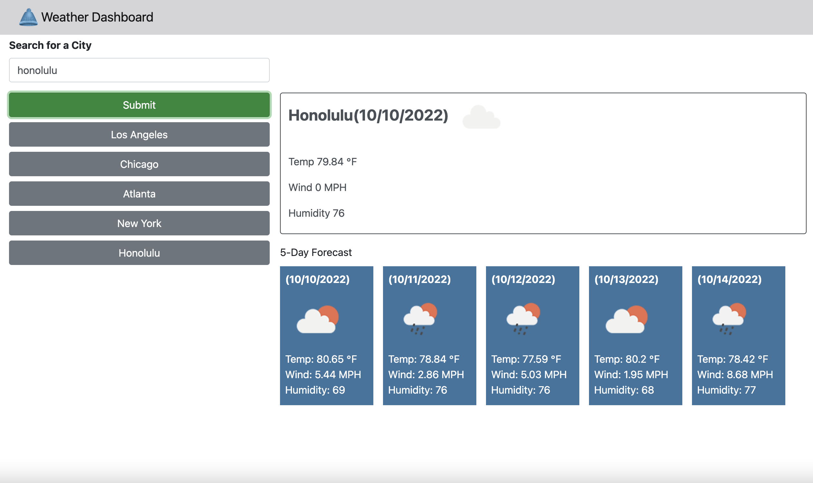

# Weather Dashboard

## Description

* The repository shows an application for a weather dashboard where the user can search for a city and display the current weather in addition to a five day forecast of weather for that city.  This app runs in the browser and features dynamically updated HTML and CSS.  It has a responsive user interface to be laid out properly on various size screens.

* The application makes requests and retrieves data from the third party API, openweathermap.org, to show the resulting weather details. 

* The user types a city in the search field and upon selecting the "submit" button, the city's current weather shows in a text area to the right.  Below that text area, are 5 cards that show the forecasted weather for the next five days thereafter, including the forecast for the temperature in farenheit, wind speed in MPH, and the humidity.

* The application uses local storage to store persistent data.  The cities a user searches for are saved in local storage. Upon completing a search of a city, that city's name is displayed as a clickable button and placed under the "submit" button.  A button is displayed for each search and placed below the last button shown.  When a user selects a button for one of the cities, the current forecast and the five day forecast will be shown for that city, the same as if the user searched for the city.

* The HTML code contains a logical structure for the elements within the page.  There are sections within the body for each section on the page.

* The project uses Bootstrap with a link shown on the head section of the HTML.  There is also linked CSS stylesheet in the head section of the HTML. 

* Also, the project uses Moments.js with links under the script tag on the HTML page.  There is a linked Javascipt file as well under the script tag.

* Notes have been applied to the HTML code, CSS and JavaScript code to identify each section of code. 

## Installation

* The project is currently running on Github server.  It can be viewed at: https://c-alanwill.github.io/weather-dashboard/

The code for this project can be found on GitHub at: https://github.com/c-alanwill/weather-dashboard

There is an index.html file to view the application.  

## Usage

The following image demonstrates the web application's appearance and functionality:

## Credits

N/A

## License

Please refer to the license in the repo.